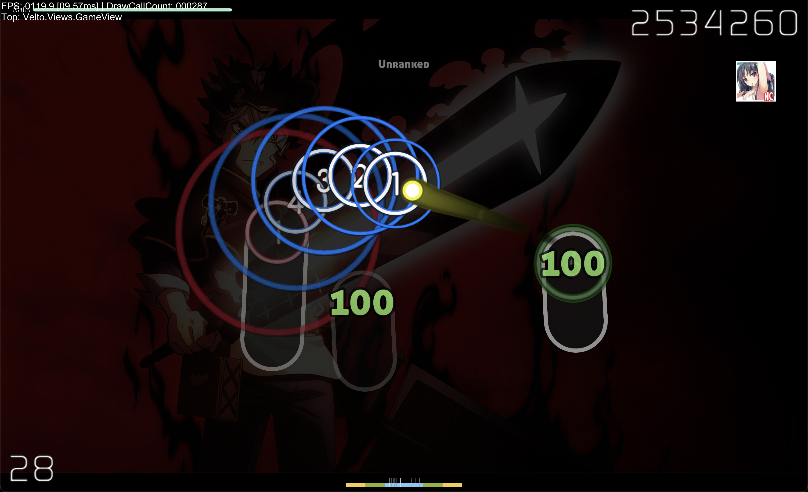

# Velto

An osu! player written with my ass, featuring yahay505.

> Yes, the repository contains copyrighted material.

## Preview

## Controls

### General
| Key | Action                         |
|------|--------------------------------|
| `Space` / `Esc` | Pause                          |
| `Left Arrow` / `Right Arrow` | Seek ±1 second                 |
| `Shift` + `Left/Right Arrow` | Change song speed              |
| `Click + Drag` Timeline | Seek through the song          |
| `Tab` | Open song select (not anymore) |

### Debug
| Key  | Action                                |
|------|---------------------------------------|
| `F1` | Toggle timeline and debug information |
| `F2` | Switch to freeplay                    |
| `F3` | Switch to autoplay                    |
| `F3` | Load the replay demo                  |

### Extras
| Key | Action |
|------|---------|
| `Ctrl + Scroll Wheel` | Adjust volume |
| `Ctrl + S` | Swap skins |
| `Ctrl + D` | Toggle Nightcore |

## Features

- osu! beatmap playback
- Song selection menu
- Skin swapping
- DT/NC (sort of)
- Replay / Autoplay / Freeplay
- Debug timeline and playback controls

## Disclaimer

This repository includes copyrighted assets and materials. They are provided for preservation, compatibility, and demonstration purposes.